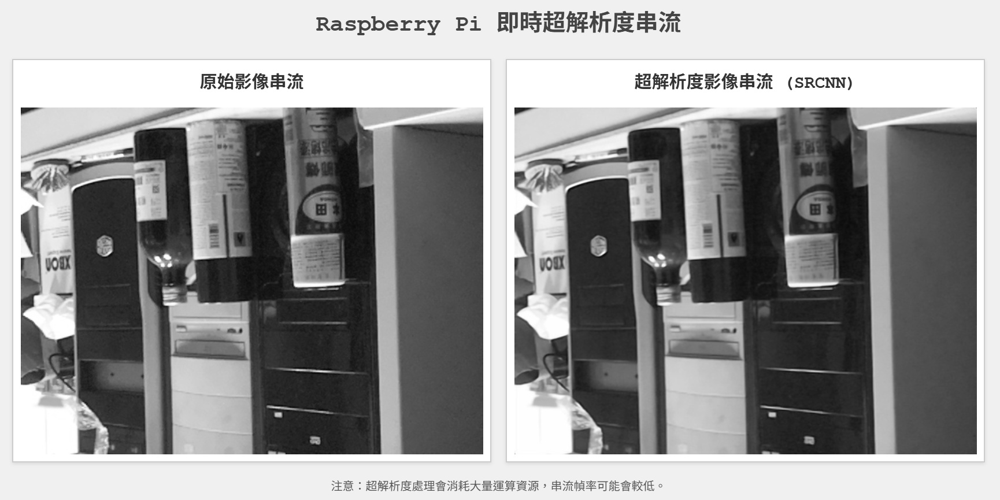

# SRCNN Project (Super Resolution by CNN)
本專案訓練了一個超解析度卷積神經網路 (SRCNN) 模型，並將其透過參數量化的方式部署到 Raspberry Pi4 上，以對來自相機的即時影像進行超解析度處理，最後透過 HTTP 將原始影像和處理後的影像串流到網頁瀏覽器進行展示。另外，還分析了在不同量化參數選擇下， SRCNN 在 edge 端（Raspberry Pi4）的表現。



相關文獻閱讀筆記與研究報告 slides 在 [Notion](https://mire-power-709.notion.site/SRCNN-Project-Super-Resolution-by-CNN-20eb695eb67680cfa907ee49e66a3191).

## 主要功能
* __模型訓練__： 使用 TensorFlow/Keras 訓練 SRCNN 模型以提升影像解析度。
* __模型轉換__： 將訓練好的 Keras 模型 (.h5) 轉換為適用於邊緣裝置的 TensorFlow Lite (.tflite) 格式。
* __Raspberry Pi 部署__： 在 Raspberry Pi 上運行 TFLite 模型進行推論。
* __即時影像擷取__： 使用 picamera2 套件從 Raspberry Pi 相機模組擷取即時影像。
* __超解析度處理__： 對擷取的影像幀應用 SRCNN 模型以提升解析度。
* __HTTP 影像串流__： 使用 Flask 建立一個 Web 伺服器，同時串流原始影像和經過超解析度處理的影像。
* __網頁展示__： 提供一個簡單的 HTML 頁面，用於在瀏覽器中並排顯示兩個影像串流。

## 專案結構
專案中的所有程式統一放在 src/ 目錄下，以下說明各檔案的用途：

```
.
├── 1_model_training_and_conversion/  # Stage1：模型訓練與轉換 (在 PC 上執行)
│   ├── CheckGPU.py                   # 檢查 GPU 環境
│   ├── train_srcnn.py                # 主要的模型訓練程式
│   ├── inspect_model.py              # 檢查模型結構的工具
│   ├── srcnn_model_v1.h5             # 訓練好的 .h5 模型
│   └── converter                     # 存放各種不同數字型態將 .h5 模型轉換為 .tflite 的工具
│       ├── convert_model_FP16.py     # 將模型權重轉為 float16
│       ├── convert_model_INT8.py     # 將模型權重轉為 int8
│       └── convert_model.py          # 單純轉換
│
├── 2_raspberry_pi_deployment/        # Stage2：Raspberry Pi 部署應用
│   ├── app.py                        # 主要的 Flask 應用程式 (用於串流)
│   ├── appFPS.py                     # 獨立的 FPS 測試程式
│   ├── srcnn_model_FP16.tflite       # 轉換好的 .tflite 模型（float16）
│   ├── srcnn_model_INT8.tflite       # 轉換好的 .tflite 模型（int8）
│   ├── srcnn_model_OPT.tflite        # 轉換好的 .tflite 模型
│   ├── srcnn_model.tflite            # 轉換好的 .tflite 模型（啟用優化）
│   └── templates/
│       └── index.html                # 網頁前端範本
│
├── utils/                            # 輔助工具與程式
│   ├── create_lr_images.py           # 產生低解析度影像資料集的程式
│   └── convert_grayscale.py          # 轉換影像為灰階的工具
│
├── dataset/                          # 資料集存放區
│   ├── hr_train/                     # 原始高解析度 training 影像
│   │   └── ...
│   ├── lr_train/                     # 產生的低解析度 training 影像
│   │   └── ...
│   ├── hr_valid/                     # 原始高解析度 valid 影像
│   │   └── ...
│   └── lr_valid/                     # 產生的低解析度 valid 影像
│       └── ...
│
├── training_logs/                    # 訓練日誌與結果
│   ├── train_run_1.0/                # 每次訓練的獨立資料夾
│   │   ├── training_history.png      # 訓練歷史曲線圖
│   │   ├── comparison_xxxx.png       # 訓練後的評估比較圖
│   │   ├── info.txt                  # 進行此次訓練的參數
│   │   └── training_output.log       # 訓練過程的文字日誌
│   └── ...                           # 其他訓練紀錄
│
└── README.md                         # 專案說明文件
```

注： dataset 內容需要自行收集圖片資料，例如：[DIV2K](https://data.vision.ee.ethz.ch/cvl/DIV2K/)（提供大量高解析度圖片）

## 設定與安裝
1. __模型訓練環境__
    * __Python 環境__： 使用虛擬環境 (如 venv 或 Conda)。
    ```
    python -m venv sr_env
    source sr_env/bin/activate  # for macOS/Linux
    sr_env\Scripts\activate     # for Windows
    ```
    * __安裝 TensorFlow 及相關套件__：
    ```
    pip install tensorflow # 或 tensorflow-macos (適用於 Apple Silicon)
    pip install tensorflow-metal # (適用於 Apple Silicon GPU 加速)
    pip install numpy matplotlib opencv-python Pillow scikit-image
    ```
    * __準備資料集__：
     將高解析度影像放入 `dataset/hr_train` 和 `dataset/hr_val` 。您可以使用 `utils/CreateLR_ING.py` 來產生對應的低解析度影像。

2. __Raspberry Pi 部署環境__
    * __Raspberry Pi OS__： 
    建議使用基於 Debian Bullseye 或更新版本的 Raspberry Pi OS (以支援 picamera2)。
    * __啟用相機介面 (libcamera)__：
    ```
    sudo raspi-config
    # 選擇 Interface Options -> Camera -> Enable (確保不是 Legacy Camera)
    # 完成後重新啟動
    ```
    * __安裝必要的 Python 套件__：
    ```
    sudo apt install python3-picamera2 -y
    pip3 install numpy --break-system-packages
    pip3 install opencv-python-headless --break-system-packages
    pip3 install Flask --break-system-packages
    pip3 install Pillow --break-system-packages
    ```
    * __安裝 TensorFlow Lite Runtime__：
    根據您的 Raspberry Pi OS 版本和架構 (armv7l 或 aarch64) 從 TensorFlow 官方網站或可信來源下載合適的 .whl 檔案並安裝。
    一個可能的安裝方式 (如果您的 Pi OS 和 Python 版本受支援)：
    ```
    echo "deb https://packages.cloud.google.com/apt coral-edgetpu-stable main" | sudo tee /etc/apt/sources.list.d/coral-edgetpu.list
    curl https://packages.cloud.google.com/apt/doc/apt-key.gpg | sudo apt-key add -
    sudo apt update
    sudo apt install python3-tflite-runtime -y
    ```
    如果上述方式失敗，請手動下載並安裝 wheel 檔案。

## 使用流程
1. __訓練 SRCNN 模型__
    1. __準備資料集__： 確保 dataset/hr_train 和 dataset/hr_val 中有足夠的高解析度影像。
    2. __配置訓練腳本__： 打開 1_model_training_and_conversion/train_srcnn.py ，根據您的需求修改以下參數：
        * `LR_TRAIN_DIR`, `HR_TRAIN_DIR`, `LR_VAL_DIR`, `HR_VAL_DIR` (指向您的資料集路徑)
        * `TARGET_SHAPE_FOR_DATA` (模型訓練時的輸入/輸出影像塊尺寸，例如： `(512, 512)` )
        * `SCALE_FACTOR_ASSUMED_FOR_LR_CREATION` (例如 `6`，用於產生 LR 影像的降採樣倍率)
        * `EPOCHS`, `BATCH_SIZE`, `INITIAL_LEARNING_RATE`
        * `MODEL_SAVE_PATH`
    3. __執行訓練__：
        ```
        cd training_scripts
        python train_srcnn.py
        ```
        訓練完成後，模型將儲存到指定的 .h5 路徑。
2. __將 Keras 模型轉換為 TensorFlow Lite__
    1. __轉換程式__： 打開 `1_model_training_and_conversion/converter/convert_model.py`。
        * 確認 `KERAS_MODEL_PATH` 指向您剛訓練好的 `.h5` 模型。
        * 確認 `TFLITE_MODEL_SAVE_PATH` 為您期望的 `.tflite` 輸出路徑。
        * 確保 `MODEL_INPUT_HEIGHT`, `MODEL_INPUT_WIDTH` 與訓練時的 `TARGET_SHAPE_FOR_DATA` 一致。
    2. __執行轉換__：
    ```
    python convert_to_tflite.py
    ```
    轉換後的 `.tflite` 模型將被儲存。
3. __在 Raspberry Pi 上運行即時串流應用__
    1. __複製檔案到 Raspberry Pi__：
        * 將轉換後的 `.tflite 模型檔案` (例如 `srcnn_model.tflite`) 複製到 Raspberry Pi 上的 `rpi_sr_streamer/` 資料夾內。
        * 將 `2_raspberry_pi_deployment/app.py` 和 `2_raspberry_pi_deployment/templates/i
    2. __配置 app.py__：
        * 打開 Raspberry Pi 上的 `2_raspberry_pi_deployment/app.py`。
        * 確認 `TFLITE_MODEL_PATH` 指向您複製過來的 `.tflite` 模型檔案。
        * 確認 `MODEL_INPUT_SHAPE_HW` 與模型轉換時使用的輸入尺寸一致 (例如 `(512, 512)`)。
        * 確認 `INFERENCE_SCALE_FACTOR` 與您期望的放大倍率一致 (應與訓練時的 `SCALE_FACTOR_ASSUMED_FOR_LR_CREATION` 相同，例如 `6`)。
        * 根據需要調整 `CAMERA_WIDTH`, `CAMERA_HEIGHT`, `CAMERA_FRAMERATE`。
    3. __執行應用程式__：
    在 Raspberry Pi 的終端機中，導到 `2_raspberry_pi_deployment/` 資料夾：
    ```
    cd path/to/2_raspberry_pi_deployment
    python3 app.py
    ```
    4. __查看串流__：
        * 應用程式啟動後，會顯示類似 `* Running on http://0.0.0.0:5000` 的訊息。
        * 在同一網路下的電腦瀏覽器中，訪問 `http://<RaspberryPi_IP_Address>:5000` (將 `<RaspberryPi_IP_Address>` 替換為您 Raspberry Pi 的實際 IP 位址)。
        * 應該能看到原始影像和超解析度處理後的影像串流。

## 使用工具與套件
* __Python 3__
* __TensorFlow / Keras__: 用於模型訓練。
* __TensorFlow Lite__: 用於在 Raspberry Pi 上進行模型推論。
* __OpenCV (cv2)__: 用於影像處理和顏色空間轉換。
* __Pillow (PIL)__: 用於影像處理，特別是 resize。
* __NumPy__: 用於數值運算。
* __Picamera2__: 用於從 Raspberry Pi 相機模組擷取影像。
* __Flask__: 用於建立 Web 伺服器和 HTTP 串流。
* __HTML / CSS / JavaScript__: 用於前端網頁展示。

## 注意事項
在 Raspberry Pi 上進行即時高倍率超解析度處理非常消耗計算資源，即使把模型參數量化到最輕量的 int8 ，超解析度串流的幀率可能依然會較低。